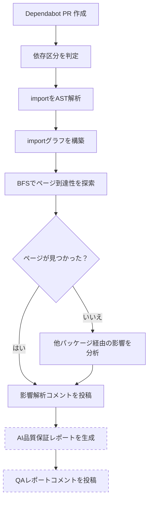

# dependabot-insight

静的解析で Dependabot PR の影響範囲を特定し、AIによる品質保証レポートを自動生成する GitHub Action です。

> [English](./README.md) | 日本語

## 何ができるか

Dependabot が PR を作成すると、この Action が自動的に以下を実行します:

1. **パッケージの依存区分を判定** — ランタイム依存（dependencies）か、開発時依存（devDependencies）か、他パッケージの内部依存（transitive）かを特定
2. **影響が到達するページ・APIルートを追跡** — TypeScript AST 解析でimportグラフを辿り、更新パッケージから到達可能な Next.js のページ・APIルートを特定
3. **他パッケージ経由の影響を分析** — 直接 import がない場合、`package-lock.json` を解析して推移的依存関係を追跡
4. **AIによる品質保証レポートを生成** — Claude API を使い、リスク評価付きの具体的なテスト計画を作成

結果は PR コメントとして投稿され、レビュワーがマージ判断に必要な情報をすべて提供します。

### 出力例

<details>
<summary>影響解析コメント</summary>

> ## 影響解析
>
> ### パッケージの位置づけ
>
> | パッケージ | 依存区分 | 説明 |
> |---|---|---|
> | `date-fns` | **dependencies** | package.json の dependencies に記載。ランタイムで使用される |
>
> ### 影響サマリー
>
> | 項目 | 値 |
> |------|-----|
> | 更新種別 | `minor` |
> | ソースコードで直接 import しているファイル数 | 4 |
> | 影響が到達するページ数 | 3 |
> | 影響が到達するAPIルート数 | 0 |
>
> ### 影響が到達するページ
>
> - `/dashboard`
> - `/users/:id`
> - `/settings`

</details>

<details>
<summary>AI 品質保証レポートコメント</summary>

> ## 品質保証レポート
>
> ### 1. パッケージの必要性
> `date-fns` は `dependencies`（ランタイム）に記載されています。日付のフォーマットや操作に使用されており、削除すると複数のページで日付表示が壊れます。
>
> **検証手順:**
> ```bash
> cat package.json | grep "date-fns"
> grep -r "date-fns" src/ --include="*.ts" --include="*.tsx" -l
> ```
>
> ### 2. 変更内容
> `date-fns` の minor 更新（3.6.0 → 3.7.0）。date-fns は日付ユーティリティライブラリです。
>
> ### 3. 影響範囲
>
> | 区分 | 範囲 | 詳細 |
> |------|------|------|
> | 直接 import | 4ファイル, 3ページ | `src/utils/format-date.ts`、`src/components/DateDisplay.tsx` 等 |
> | 他パッケージ経由 | なし | なし |
>
> ### 4. 品質保証計画
>
> | No. | 検証対象 | 検証区分 | 確認方法 | 期待結果 |
> |-----|---------|---------|---------|---------|
> | 1 | ダッシュボード | 画面確認 | `<pr-preview-url>/dashboard` を開き、日付カラムを確認 | 日付が正しいフォーマットで表示されること |
> | 2 | ユーザー詳細 | 画面確認 | `<pr-preview-url>/users/1` を開く | 作成日時・更新日時が正しく表示されること |
>
> ### 5. 前提条件
> - 静的解析が `date-fns` を import している全ファイルを正しく特定していること

</details>

## セットアップ

### 1. シークレットの設定

リポジトリの **Settings > Secrets and variables > Actions** で以下を追加してください:

| シークレット | 必須 | 説明 |
|------------|------|------|
| `ANTHROPIC_API_KEY` | No | [Anthropic Console](https://console.anthropic.com/) から取得した API キー。AI 品質保証レポートの生成に必要。省略時は静的解析のみ投稿 |

> `GITHUB_TOKEN` は GitHub Actions が自動提供するため、手動設定は不要です。

### 2. ワークフローファイルの作成

`.github/workflows/dependabot-insight.yml` を作成してください:

```yaml
name: Dependabot Insight

on:
  pull_request:
    types: [opened, synchronize, reopened]
  issue_comment:
    types: [created]

permissions:
  contents: read
  pull-requests: write
  issues: write

jobs:
  analyze:
    if: |
      (github.event_name == 'pull_request' && github.event.pull_request.user.login == 'dependabot[bot]') ||
      (github.event_name == 'issue_comment' && github.event.issue.pull_request && contains(github.event.comment.body, '/dep-insight'))
    runs-on: ubuntu-latest
    steps:
      - uses: actions/checkout@v4

      - uses: nokki-y/dependabot-insight@v1
        with:
          github-token: ${{ secrets.GITHUB_TOKEN }}
          anthropic-api-key: ${{ secrets.ANTHROPIC_API_KEY }}
          ai-language: ja
```

### 全オプション指定

```yaml
      - uses: nokki-y/dependabot-insight@v1
        with:
          github-token: ${{ secrets.GITHUB_TOKEN }}
          anthropic-api-key: ${{ secrets.ANTHROPIC_API_KEY }}
          ai-model: 'claude-sonnet-4-6'          # Claude モデル（デフォルト: claude-sonnet-4-6）
          ai-language: 'ja'                        # QA レポートの言語（デフォルト: en）
          base-url: 'https://my-app-pr-123.vercel.app'  # GUI 確認用 URL
```

### コメントでトリガー

Dependabot PR に `/dep-insight` とコメントすると、手動で解析を実行できます。

### 入力パラメータ

| パラメータ | 必須 | デフォルト | 説明 |
|-----------|------|-----------|------|
| `github-token` | Yes | — | PR コメント投稿用の GitHub トークン |
| `anthropic-api-key` | No | — | AI 品質保証レポート生成用の Anthropic API キー。省略時は静的解析のみ投稿 |
| `ai-model` | No | `claude-sonnet-4-6` | QA レポート生成に使用する Claude モデル |
| `ai-language` | No | `en` | 影響解析コメントと AI QA レポートの両方の言語。`en`（英語）と `ja`（日本語）は完全対応。その他の言語コード（例: `ko`, `zh`）は AI QA レポートのみに影響（Claude にそのまま渡される）。影響解析コメントは英語にフォールバック |
| `base-url` | No | — | GUI 確認用リンクのベース URL（例: Vercel プレビュー URL） |

## 仕組み



| ステップ | 説明 |
|---------|------|
| 依存区分を判定 | `package.json` を読み取り → dependencies / devDependencies / transitive |
| importをAST解析 | TypeScript AST → import/require/export 宣言を収集 |
| importグラフを構築 | ファイル A → B → C の依存関係を有向グラフ化 |
| BFSでページ到達性を探索 | 逆方向に探索 → `page.tsx` / `route.ts` に到達するか判定 |
| 他パッケージ経由の影響を分析 | `package-lock.json` を解析 → どのパッケージが更新対象に依存しているか |
| 影響解析コメントを投稿 | PR コメントとして影響サマリーを投稿 |
| AI品質保証レポートを生成（破線） | Claude API → テスト計画と確認手順。`anthropic-api-key` 設定時のみ実行 |
| QAレポートコメントを投稿（破線） | PR コメントとして品質保証レポートを投稿 |

## 前提条件

- **npm** — 推移的依存関係の解析に `package-lock.json` を使用します。yarn・pnpm には未対応です。
- **Next.js App Router** — App Router の規約に基づき `page.tsx` / `route.ts` への影響到達を追跡します。

### Next.js App Router 対応状況

- `page.tsx` / `page.ts` をページとして検出
- `app/api/` 配下の `route.ts` を API ルートとして検出
- `tsconfig.json` のパスエイリアスを解決
- Route Groups `(group)`、Dynamic Segments `[id]`、Catch-all `[...slug]` に対応

> 他のパッケージマネージャー（yarn、pnpm）やフレームワーク（Pages Router、Remix、SvelteKit 等）には現在対応していません。対応が必要な場合は [Issue](https://github.com/nokki-y/dependabot-insight/issues) でリクエストしてください。

## セキュリティ

セキュリティ設計の詳細は [docs/security.ja.md](./docs/security.ja.md) を参照してください:

- データフロー図 — GitHub API・Claude API に送信される情報
- 組み込みの保護機能（シークレットマスキング、エラーサニタイズ、gitleaks）
- プライベートリポジトリでの注意事項

## 開発

```bash
git clone https://github.com/nokki-y/dependabot-insight.git
cd dependabot-insight
npm install
```

### テストとローカル開発

スクリプトのローカル実行および統合テストの方法は [docs/testing.ja.md](./docs/testing.ja.md) を参照してください。

## ライセンス

MIT
