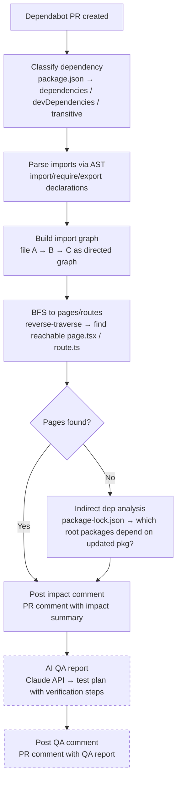

# dependabot-insight

Analyze the impact scope of Dependabot PRs with static analysis and generate AI-powered QA reports.

> English | [日本語](./README.ja.md)

## What it does

When Dependabot creates a PR, this action automatically:

1. **Classifies the dependency** — Is it a runtime dependency, dev dependency, or transitive (internal dependency of another package)?
2. **Traces impact to pages/routes** — Uses TypeScript AST parsing to follow the import graph from the updated package to reachable Next.js pages and API routes
3. **Analyzes indirect dependencies** — If no direct imports are found, parses `package-lock.json` to identify which project packages transitively depend on the updated package
4. **Generates a QA report with AI** — Calls the Claude API to produce a risk-scored quality assurance plan with concrete test steps

The results are posted as PR comments, giving reviewers everything they need to decide whether to merge.

### Example output

<details>
<summary>Impact Analysis Comment</summary>

> ## Impact Analysis
>
> ### Dependency Classification
>
> | Package | Classification | Description |
> |---|---|---|
> | `dompurify` | **dependencies** | Listed in package.json dependencies. Used at runtime |
>
> ### Impact Summary
>
> | Item | Value |
> |------|-------|
> | Update type | `patch` |
> | Files that directly import this package | 3 |
> | Pages impacted | 5 |
> | API routes impacted | 0 |
>
> ### Impacted Pages
>
> - `/admin/surveys/:id/edit`
> - `/admin/reports/:id`
> - ...

</details>

<details>
<summary>AI QA Report Comment</summary>

> ## QA Report
>
> ### 1. Package Necessity
> `dompurify` is listed in `dependencies` (runtime). It is used for HTML sanitization to prevent XSS attacks. Removing it would break security protections.
>
> **Verification:**
> ```bash
> cat package.json | grep "dompurify"
> grep -r "dompurify" src/ --include="*.ts" --include="*.tsx" -l
> ```
>
> ### 2. Change Summary
> `dompurify` patch update (3.3.1 → 3.3.2). DOMPurify is an HTML sanitization library.
>
> ### 3. Impact Scope
>
> | Scope | Range | Details |
> |-------|-------|---------|
> | Direct import | 3 files, 5 pages | `src/components/RichTextEditor.tsx`, ... |
> | Via other packages | None | None |
>
> ### 4. QA Plan
>
> | No. | Target | Type | How to Verify | Expected Result |
> |-----|--------|------|---------------|-----------------|
> | 1 | Rich text editor | GUI check | Open `<pr-preview-url>/admin/surveys/:id/edit`, enter HTML with `<script>` tags | Content is sanitized, script tags are removed |
> | 2 | Report viewer | GUI check | Open `<pr-preview-url>/admin/reports/:id` | HTML content renders without XSS |
>
> ### 5. Assumptions
> - Static analysis correctly identified all files importing `dompurify`

</details>

## Setup

### 1. Configure secrets

Go to your repository **Settings > Secrets and variables > Actions** and add:

| Secret | Required | Description |
|--------|----------|-------------|
| `ANTHROPIC_API_KEY` | No | API key from [Anthropic Console](https://console.anthropic.com/). Required for AI QA report generation. If omitted, only the static impact analysis is posted |

> `GITHUB_TOKEN` is automatically provided by GitHub Actions — no manual setup needed.

### 2. Create workflow file

Create `.github/workflows/dependabot-insight.yml`:

```yaml
name: Dependabot Insight

on:
  pull_request:
    types: [opened, synchronize, reopened]
  issue_comment:
    types: [created]

permissions:
  contents: read
  pull-requests: write
  issues: write

jobs:
  analyze:
    if: |
      (github.event_name == 'pull_request' && github.event.pull_request.user.login == 'dependabot[bot]') ||
      (github.event_name == 'issue_comment' && github.event.issue.pull_request && contains(github.event.comment.body, '/dep-insight'))
    runs-on: ubuntu-latest
    steps:
      - uses: actions/checkout@v4

      - uses: nokki-y/dependabot-insight@v1
        with:
          github-token: ${{ secrets.GITHUB_TOKEN }}
          anthropic-api-key: ${{ secrets.ANTHROPIC_API_KEY }}
```

### With all options

```yaml
      - uses: nokki-y/dependabot-insight@v1
        with:
          github-token: ${{ secrets.GITHUB_TOKEN }}
          anthropic-api-key: ${{ secrets.ANTHROPIC_API_KEY }}
          ai-model: 'claude-sonnet-4-6'          # Claude model (default: claude-sonnet-4-6)
          ai-language: 'ja'                        # QA report language (default: en)
          base-url: 'https://my-app-pr-123.vercel.app'  # For GUI verification URLs
```

### Trigger via comment

Post `/dep-insight` as a comment on any Dependabot PR to trigger the analysis manually.

### Inputs

| Input | Required | Default | Description |
|-------|----------|---------|-------------|
| `github-token` | Yes | — | GitHub token for posting PR comments |
| `anthropic-api-key` | No | — | Anthropic API key for AI QA report generation. If omitted, only the static impact analysis is posted |
| `ai-model` | No | `claude-sonnet-4-6` | Claude model to use for QA report generation |
| `ai-language` | No | `en` | Language for the AI QA report. `en` (English) and `ja` (Japanese) have optimized prompts. Other language codes (e.g., `ko`, `zh`) are passed to Claude as-is |
| `base-url` | No | — | Base URL for GUI verification links in the QA report (e.g., Vercel preview URL) |

## How it works



## Prerequisites

- **npm** — Parses `package-lock.json` for transitive dependency analysis. yarn and pnpm are not yet supported.
- **Next.js App Router** — Traces impact to `page.tsx` / `route.ts` files using App Router conventions.

### Next.js App Router support

- Detects `page.tsx` / `page.ts` as pages
- Detects `route.ts` in `app/api/` as API routes
- Resolves `tsconfig.json` path aliases
- Handles Route Groups `(group)`, Dynamic Segments `[id]`, Catch-all `[...slug]`

> Other package managers (yarn, pnpm) and frameworks (Pages Router, Remix, SvelteKit, etc.) are not currently supported. If you need support for these, please [open an issue](https://github.com/nokki-y/dependabot-insight/issues).

## Security

See [docs/security.md](./docs/security.md) for the full security design document, including:

- Data flow diagram — what is sent to GitHub API and Claude API
- Built-in protections (secret masking, error sanitization, gitleaks)
- Considerations for private repositories

## Development

```bash
git clone https://github.com/nokki-y/dependabot-insight.git
cd dependabot-insight
npm install
```

### Testing and local development

See [docs/testing.md](./docs/testing.md) for how to run scripts locally and perform integration testing.

## License

MIT
