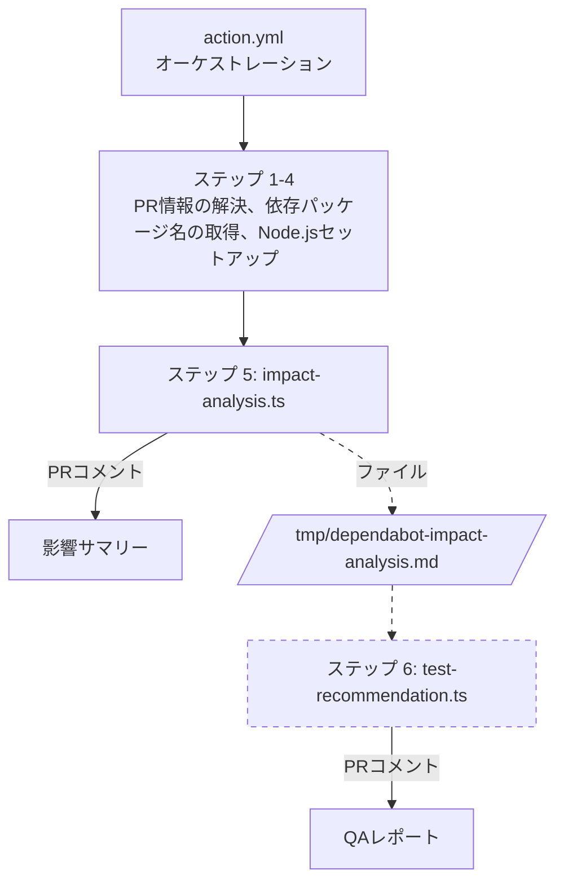
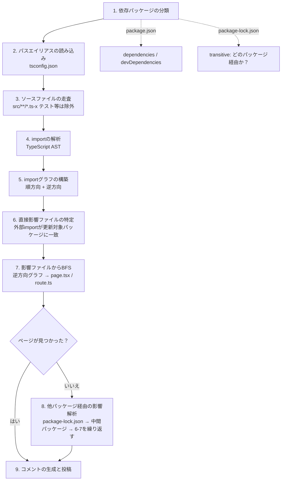
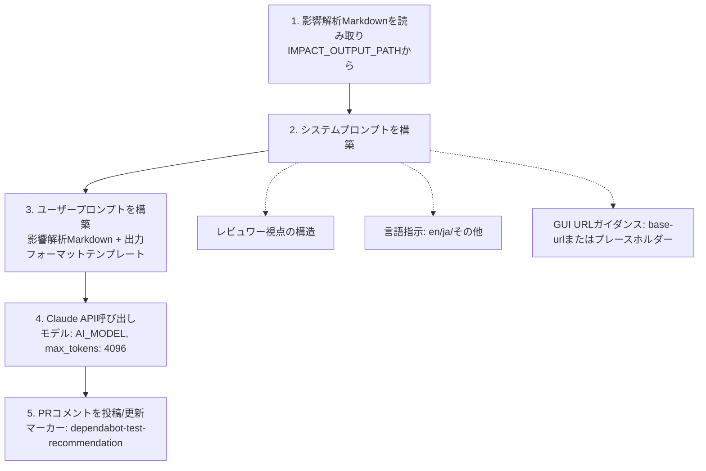
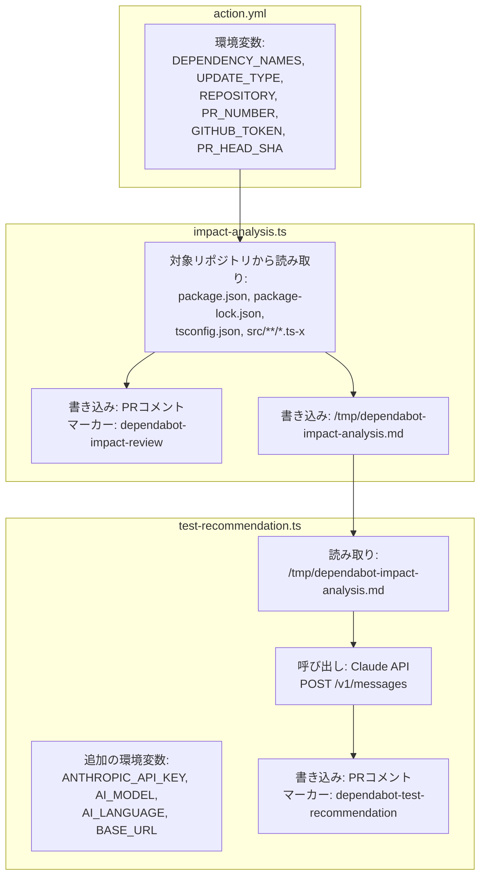

# 設計ドキュメント

> [English](./design.md) | 日本語

このドキュメントでは、dependabot-insight パイプラインの設計を説明します。各コンポーネントの責務、コンポーネント間のデータフロー、主要な設計判断の根拠を記載しています。

## 1. パイプライン概要

dependabot-insight は、GitHub Actions の composite action として順番に実行される3つのコンポーネントで構成されています:

> ステップ 6（破線）は `ANTHROPIC_API_KEY` 設定時のみ実行されます。

2つのスクリプトは一時ファイル（`IMPACT_OUTPUT_PATH`）を介してデカップリングされています。これにより:
- `impact-analysis.ts` は AI ステップなしで単独実行可能
- `test-recommendation.ts` は Markdown 出力のみを必要とし、解析の内部状態に依存しない
- `ANTHROPIC_API_KEY` が未設定の場合、パイプラインは静的解析のみで正常に完了する

## 2. action.yml（オーケストレーション）

### 責務

PR メタデータの解決、依存パッケージ情報の抽出、2つの解析スクリプトの順次実行。

### ステップごとの処理

| ステップ | 名前 | 目的 | 実行条件 |
|---------|------|------|---------|
| 1 | シークレットのマスク | `GITHUB_TOKEN`、`ANTHROPIC_API_KEY`、`BASE_URL` を `::add-mask::` で登録 | 常に |
| 2 | PR 情報の解決 | トリガーイベントから PR 番号と head SHA を取得 | 常に |
| 3 | Dependabot メタデータ取得 | `dependabot/fetch-metadata` でパッケージ名と更新種別を取得 | `pull_request` イベント時のみ |
| 4 | ブランチ名からパッケージ名を解決 | ブランチ名または PR タイトルをパースしてパッケージ名を抽出 | `issue_comment` イベント時 |
| 5 | Node.js セットアップ + 依存インストール | `actions/setup-node` + Action ディレクトリで `npm ci --production` | 常に |
| 6 | impact-analysis.ts 実行 | 静的解析を実行し、影響サマリーを PR コメントとして投稿 | 常に |
| 7 | test-recommendation.ts 実行 | Claude API を呼び出し、QA レポートを PR コメントとして投稿 | `anthropic-api-key` 設定時のみ |

### 設計判断

**なぜ composite action（JavaScript action ではなく）か？**

GitHub Actions では TypeScript ベースの Action に2つのアプローチがある:

| | JavaScript action | Composite action（採用） |
|---|---|---|
| ビルドステップ | 必要（`@vercel/ncc` でバンドル → `dist/index.js`） | 不要 |
| リポジトリ内のビルド成果物 | `dist/` のコミットが必要 | なし |
| ソースと成果物の乖離リスク | ビルド忘れで `dist/` とソースが乖離する可能性 | リスクなし — ソースがそのまま実行される |
| PR の差分ノイズ | `dist/index.js`（数千行）が毎回 PR に含まれる | なし |
| 起動オーバーヘッド | なし | `npm ci --production`（約3-5秒） |

composite action の唯一のデメリットは `npm ci` の起動オーバーヘッドである。しかし、この Action の総実行時間は20-50秒（import グラフ構築 約5-15秒 + Claude API 呼び出し 約10-30秒）であり、`npm ci` の3-5秒は全体の約10%に過ぎない。非同期で実行される CI タスクとしては無視できるコストである。

ビルド成果物管理のオーバーヘッドをなくし、パフォーマンスへの影響が軽微であるため、composite action を採用した。

**なぜ `pull_request` では `dependabot/fetch-metadata` を使い、他のイベントではブランチ名パースを使うか？**

`dependabot/fetch-metadata` は Dependabot PR からパッケージ名と更新種別を確実に抽出するが、`pull_request` イベントでのみ動作する。`issue_comment`（`/dep-insight` による手動再実行）ではブランチ名をパースしてフォールバックする:
- 単一パッケージ: `dependabot/npm_and_yarn/<package>-<version>` → パッケージ名を抽出
- 複数パッケージ: `dependabot/npm_and_yarn/multi-<hash>` → PR タイトルからパッケージ名を抽出

**開発中のテスト方法は？**

[docs/testing.ja.md](./testing.ja.md) を参照（ローカル DRY_RUN 実行とブランチ指定による統合テストの手順を記載）。

## 3. impact-analysis.ts（静的解析）

### 責務

対象リポジトリのソースコードを解析し、更新される依存パッケージの影響が到達する Next.js ページおよび API ルートを特定し、結果を PR コメントとして投稿する。

### 処理フロー

### 主要な関数

| 関数 | 目的 |
|------|------|
| `classifyDependency` | パッケージが dependencies / devDependencies / transitive / not-found のどれかを判定 |
| `loadPathAliases` | `tsconfig.json` をパースして `@/`、`@modules/` 等を解決 |
| `collectImports` | TypeScript AST ビジターで import/require/export-from 宣言を抽出 |
| `buildGraphs` | スキャンした全ファイルから順方向・逆方向の import グラフを構築 |
| `findIndirectDependents` | package-lock.json の依存ツリーを BFS で逆引きし、更新対象パッケージに推移的依存するルートパッケージを発見 |
| `bfsReachablePages` | 逆方向 import グラフ上でファイルごとに BFS を実行し、到達可能な `page.tsx` と `route.ts` を発見 |
| `buildComment` | 解析結果から Markdown 形式の PR コメントを生成 |
| `upsertComment` | HTML マーカーによるべき等な PR コメントの投稿/更新 |

### 設計判断

**なぜ正規表現ではなく TypeScript AST を使うか？**

正規表現による import 検出は脆弱:
- コメントや文字列内の `import` と区別できない
- 複数行にまたがる import を処理できない
- `import type` とランタイム import を区別できない

TypeScript コンパイラ API（`ts.createSourceFile`）は、動的 `import()`、`require()`、`export ... from` を含むすべての構文バリアントを確実に処理する。

**なぜ共有 visited ではなくファイルごとの BFS か？**

全起点ファイルで `visited` セットを共有すると、最初のファイルの BFS がノードを「占有」し、後続ファイルが同じ中間ノードを経由してページに到達できなくなる。ファイルごとの BFS により、各影響ファイルが独立して全到達可能ページを発見し、正確なファイルごとのトレース情報を生成する。

**なぜ他パッケージ経由の影響解析はページが見つからない場合のみか？**

直接 import で既にページに到達している場合、他パッケージ経由の解析はノイズを増やすだけ。他パッケージ経由の解析は、直接 import されていないパッケージ（例: `eslint` が内部で使う `flat-cache` が内部で使う `flatted`）のフォールバックとして機能する。

**なぜ HTML マーカーによるアップサートか？**

`<!-- dependabot-impact-review -->` をマーカーとして使用することで、べき等なコメント更新を実現。同じ PR で Action を再実行すると、重複コメントを作成する代わりに既存コメントを更新する。

## 4. test-recommendation.ts（AI QA レポート）

### 責務

影響解析の出力を読み取り、構造化されたプロンプトと共に Claude API に送信し、生成された QA レポートを PR コメントとして投稿する。

### 処理フロー

### プロンプト設計

プロンプトは **AI が面白いと思うこと** ではなく、**レビュワーが必要とすること** を軸に構造化されている:

1. **パッケージの必要性** — このパッケージは削除可能か？レビュワーが独自に確認できる検証コマンドを含める
2. **変更内容** — 何が更新されるか（1-2文）
3. **影響範囲** — 静的解析から導出（AI が推測するのではない）
4. **QA 計画** — 各テストケースは影響範囲にトレース可能。具体的な手順（GUI URL または CLI コマンド）を含める
5. **前提条件** — このレポートが依拠するもの

**なぜリスク評価を削除したか？**

元の設計では5軸のリスクスコアリングルーブリック（依存の種類、ライブラリカテゴリ、ページ数、更新種別、機能の重要度）を含んでいた。以下の理由で削除:
- レビュワーは影響範囲と QA 計画から直接リスクを判断できる
- 数値スコアは偽の精度を生んだ（例: 「11/15 = 高」）が、実用的な情報を追加しなかった
- スコアリングに消費されるプロンプトトークンを、具体的なテスト手順に充てる方が有益

**なぜ検証コマンドを必須にするか？**

プロンプトは Claude に `npm ls <package>` や `grep -r "<package>" src/` のようなコマンドを含めるよう明示的に指示する。理由:
- レビュワーは AI の出力を全面的には信用しない
- 検証コマンドによりレポートが自己検証可能になる
- レビュワーはコマンドを実行してパッケージの必要性と影響範囲を自分で確認できる

### 設計判断

**なぜ action.yml にインラインではなく別スクリプトか？**

- 単独テスト可能（`DRY_RUN=true`）
- TypeScript により Claude API リクエスト/レスポンスの型安全性を確保
- `sanitizeError` によるエラーハンドリングはシェルスクリプトでは困難

**なぜ影響解析コメントに追記するのではなく別の PR コメントか？**

- 更新頻度が異なる: 影響解析は決定的でコード変更時のみ変化、QA レポートは AI の非決定性により実行ごとに変わる可能性がある
- 独立したアップサートマーカーにより、一方を更新しても他方に影響しない
- 影響解析コメントは QA レポートなしで存在できる（`ANTHROPIC_API_KEY` 未設定時）

## 5. コンポーネント間のデータフロー

### インターフェース契約

2つのスクリプト間の唯一の結合点は `IMPACT_OUTPUT_PATH` の Markdown ファイルです。このファイルには、影響解析 PR コメントと同一の内容が含まれます。契約は:
- **プロデューサー**（`impact-analysis.ts`）: `IMPACT_OUTPUT_PATH` で指定されたファイルパスに Markdown 文字列を書き込む
- **コンシューマー**（`test-recommendation.ts`）: ファイル全体を文字列として読み取り、Claude API プロンプトに含める

構造化されたデータ契約（例: JSON スキーマ）は存在しない。Markdown はコンシューマーによって不透明なテキストとして扱われる。これは意図的な設計: Claude API プロンプトはデータフォーマットをパースするのではなく、人間が読める Markdown を解釈するよう設計されている。
