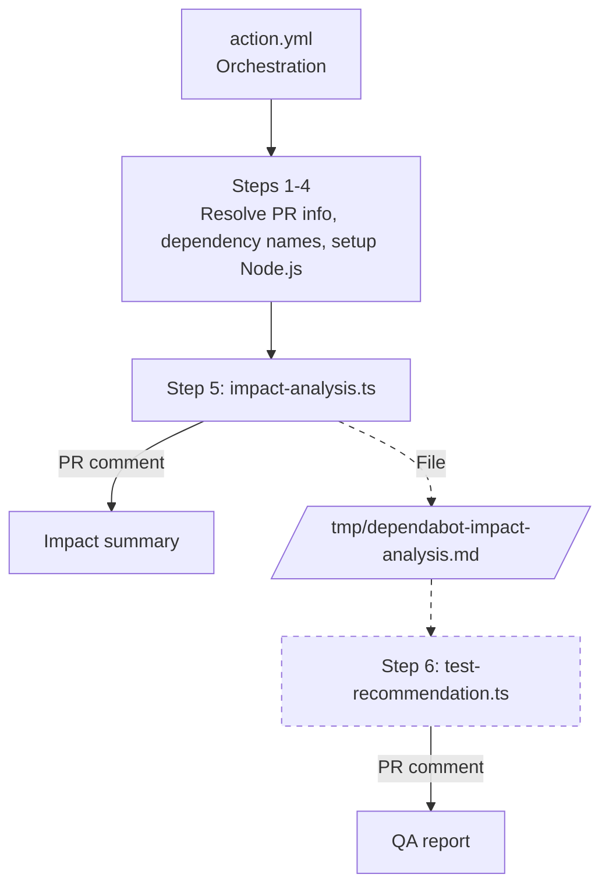
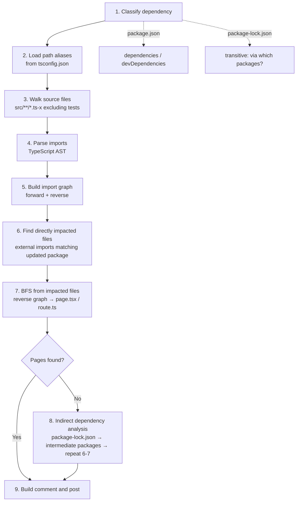
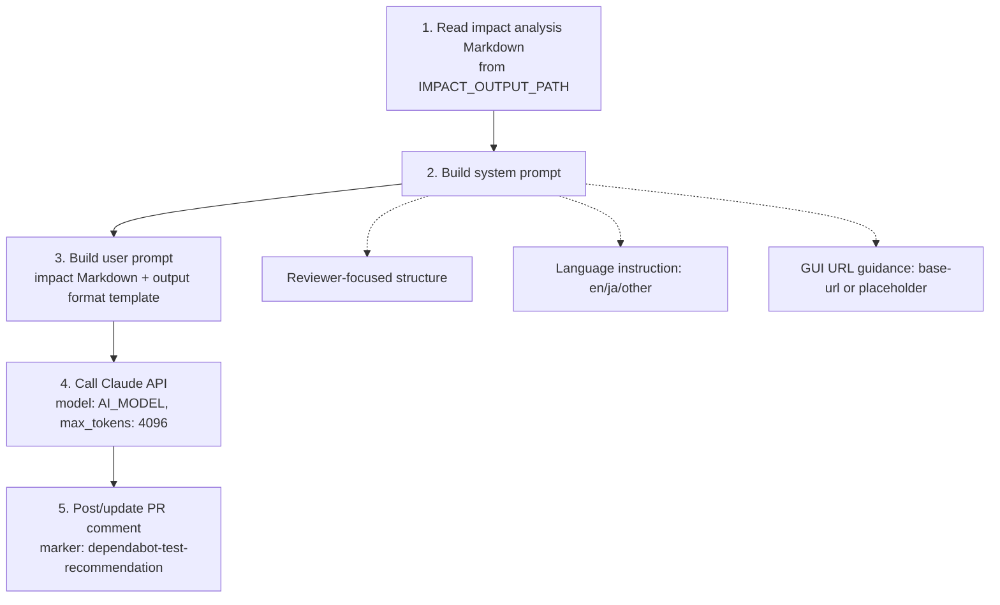
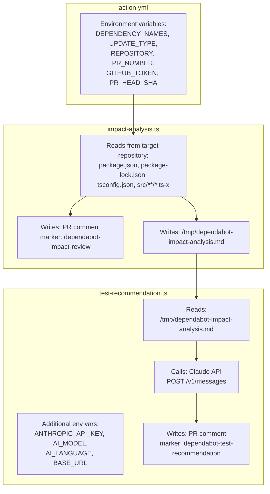

# Design Document

> English | [日本語](./design.ja.md)

This document describes the design of the dependabot-insight pipeline: the responsibilities of each component, how data flows between them, and the rationale behind key design decisions.

## 1. Pipeline Overview

dependabot-insight consists of three components that run sequentially as a GitHub Actions composite action:

> Step 6 (dashed) runs only when `ANTHROPIC_API_KEY` is provided.

The two scripts are decoupled via a temporary file (`IMPACT_OUTPUT_PATH`). This means:
- `impact-analysis.ts` can run independently without the AI step
- `test-recommendation.ts` only needs the Markdown output, not the analysis internals
- The pipeline gracefully degrades when `ANTHROPIC_API_KEY` is not provided

## 2. action.yml (Orchestration)

### Responsibility

Resolve PR metadata, extract dependency information, and execute the two analysis scripts in sequence.

### Step-by-step flow

| Step | Name | Purpose | Runs when |
|------|------|---------|-----------|
| 1 | Mask secrets in logs | Register `GITHUB_TOKEN`, `ANTHROPIC_API_KEY`, `BASE_URL` with `::add-mask::` | Always |
| 2 | Resolve PR info | Extract PR number and head SHA from the triggering event | Always |
| 3 | Fetch Dependabot metadata | Use `dependabot/fetch-metadata` to get package names and update type | `pull_request` event only |
| 4 | Resolve dependency names from branch | Parse branch name or PR title to extract package names | `issue_comment` event |
| 5 | Setup Node.js + Install deps | `actions/setup-node` + `npm ci --production` in the action's directory | Always |
| 6 | Run impact-analysis.ts | Execute static analysis and post impact comment | Always |
| 7 | Run test-recommendation.ts | Call Claude API and post QA report | Only if `anthropic-api-key` is provided |

### Design decisions

**Why composite action (not JavaScript action)?**

GitHub Actions supports two approaches for TypeScript-based actions:

| | JavaScript action | Composite action (adopted) |
|---|---|---|
| Build step | Required (`@vercel/ncc` bundle → `dist/index.js`) | Not required |
| Build artifacts in repo | `dist/` must be committed | None |
| Source/artifact sync risk | Source and `dist/` can diverge if build is forgotten | No risk — source IS the executed code |
| PR diff noise | `dist/index.js` (thousands of lines) in every PR | None |
| Startup overhead | None | `npm ci --production` (~3-5 seconds) |

The startup overhead of `npm ci` is the only disadvantage of the composite approach. However, this Action's total execution time is 20-50 seconds (import graph construction ~5-15s + Claude API call ~10-30s), so 3-5 seconds of `npm ci` accounts for roughly 10% of the total — a negligible cost for an asynchronous CI task.

The composite action approach was chosen because it eliminates build artifact management overhead with minimal performance impact.

**Why `dependabot/fetch-metadata` for `pull_request` but branch name parsing for other events?**

`dependabot/fetch-metadata` reliably extracts package names and update type from Dependabot PRs, but it only works on `pull_request` events. For `issue_comment` (manual re-run via `/dep-insight`), the Action falls back to parsing the branch name:
- Single package: `dependabot/npm_and_yarn/<package>-<version>` → extract package name
- Multi-package: `dependabot/npm_and_yarn/multi-<hash>` → parse PR title for package names

**How to test during development?**

See [docs/testing.md](./testing.md) for detailed instructions (local DRY_RUN execution and integration testing via branch reference).

## 3. impact-analysis.ts (Static Analysis)

### Responsibility

Analyze the target repository's source code to determine which Next.js pages and API routes are affected by the updated dependency, and post the results as a PR comment.

### Processing flow

### Key functions

| Function | Purpose |
|----------|---------|
| `classifyDependency` | Determine if a package is in dependencies, devDependencies, transitive, or not found |
| `loadPathAliases` | Parse `tsconfig.json` to resolve `@/`, `@modules/` etc. |
| `collectImports` | TypeScript AST visitor that extracts import/require/export-from declarations |
| `buildGraphs` | Build forward and reverse import graphs from all scanned files |
| `findIndirectDependents` | BFS on package-lock.json's dependency tree to find root packages that transitively depend on the target |
| `bfsReachablePages` | Per-file BFS on the reverse import graph to find reachable `page.tsx` and `route.ts` |
| `buildComment` | Generate the Markdown PR comment from analysis results |
| `upsertComment` | Post or update the PR comment using an HTML marker for idempotency |

### Design decisions

**Why TypeScript AST instead of regex?**

Regex-based import detection is fragile:
- Cannot distinguish `import` statements from comments or strings
- Cannot handle multi-line imports
- Cannot differentiate `import type` from runtime imports

The TypeScript compiler API (`ts.createSourceFile`) reliably handles all syntax variants including dynamic `import()`, `require()`, and `export ... from`.

**Why per-file BFS instead of shared-visited BFS?**

A shared `visited` set across all start files would cause the first file's BFS to "claim" nodes, preventing later files from reaching pages through the same intermediate nodes. Per-file BFS ensures each impacted file independently discovers all reachable pages, producing accurate per-file trace information.

**Why indirect dependency analysis only when no pages are found?**

If direct imports already reach pages, indirect analysis would only add noise. Indirect analysis is a fallback for packages that are not directly imported (e.g., `flatted` which is used internally by `flat-cache` which is used by `eslint`).

**Why upsert with HTML markers?**

Using `<!-- dependabot-impact-review -->` as a marker enables idempotent comment updates. Re-running the Action on the same PR updates the existing comment instead of creating duplicates.

## 4. test-recommendation.ts (AI QA Report)

### Responsibility

Read the impact analysis output, send it to the Claude API with a structured prompt, and post the generated QA report as a PR comment.

### Processing flow

### Prompt design

The prompt is structured around **what the reviewer needs**, not what the AI finds interesting:

1. **Package necessity** — Can this package be removed? Include verification commands so the reviewer can confirm independently.
2. **Change summary** — What is being updated (1-2 sentences).
3. **Impact scope** — Derived from the static analysis, not hallucinated.
4. **QA plan** — Each test case must trace back to the impact scope. Include concrete steps (GUI URLs or CLI commands).
5. **Assumptions** — What this report relies on.

**Why was Risk Assessment removed?**

The original design included a 5-axis risk scoring rubric (dependency type, library category, page count, update type, feature criticality). This was removed because:
- The reviewer can assess risk from the impact scope and QA plan directly
- Numeric scores created false precision (e.g., "11/15 = High") that didn't add actionable information
- The scoring consumed prompt tokens that are better spent on concrete test steps

**Why require verification commands?**

The prompt explicitly instructs Claude to include commands like `npm ls <package>` or `grep -r "<package>" src/`. This is because:
- Reviewers do not blindly trust AI output
- Verification commands make the report self-validating
- The reviewer can run the commands to confirm package necessity and impact scope

### Design decisions

**Why a separate script instead of inline in action.yml?**

- Testable independently (`DRY_RUN=true`)
- TypeScript provides type safety for the Claude API request/response
- Error handling with `sanitizeError` would be difficult to implement in shell

**Why a separate PR comment (not appended to impact analysis)?**

- Different update frequencies: impact analysis is deterministic and only changes when code changes; QA report may vary across runs due to AI non-determinism
- Independent upsert markers allow each to be updated without affecting the other
- The impact comment can exist without the QA report (when `ANTHROPIC_API_KEY` is not set)

## 5. Data Flow Between Components

### Interface contract

The only coupling between the two scripts is the Markdown file at `IMPACT_OUTPUT_PATH`. This file contains the same content as the impact analysis PR comment. The contract is:
- **Producer** (`impact-analysis.ts`): writes a Markdown string to the file path specified by `IMPACT_OUTPUT_PATH`
- **Consumer** (`test-recommendation.ts`): reads the entire file as a string and includes it in the Claude API prompt

There is no structured data contract (e.g., JSON schema) — the Markdown is treated as opaque text by the consumer. This is intentional: the Claude API prompt is designed to interpret human-readable Markdown, not parse a data format.
